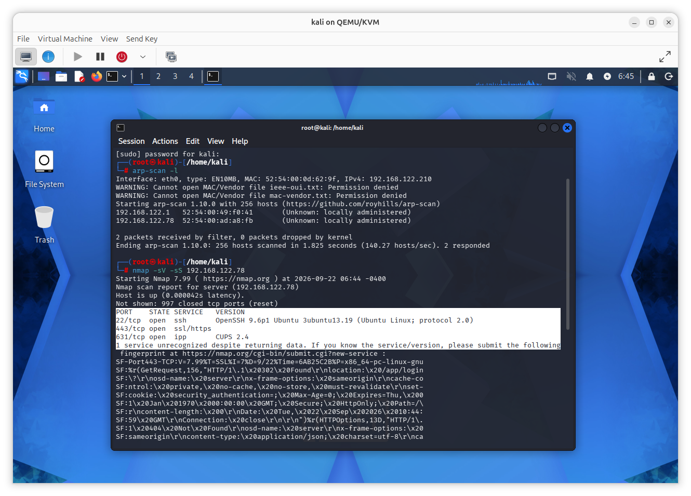

# SSH Brute-Force Detection and Mitigation Lab

## Overview

This project demonstrates how SSH password-guessing activity can be detected and mitigated in a controlled home lab environment.

The lab was built using Kali Linux and Ubuntu Server 24.04 running on QEMU/KVM. Wazuh was used for security monitoring and event analysis, while Fail2ban was configured to automatically block repeated failed SSH authentication attempts.

## Lab Architecture

- **Kali Linux** — attacker machine
- **Ubuntu Server 24.04** — target machine
- **Wazuh SIEM** — detection and log analysis
- **Fail2ban** — automated mitigation
- **SSH (Port 22)** — target service

## Objective

The goal of this project was to understand SSH brute-force/password-guessing activity from both attacker and defender perspectives.

The project focused on:

- Network reconnaissance
- SSH service enumeration
- Failed authentication simulation
- Linux authentication log analysis
- Wazuh alert investigation
- Fail2ban mitigation

## Reconnaissance

I started by scanning the local network to identify the Ubuntu Server.

After identifying the target, I used Nmap to enumerate open ports and services.

```bash
nmap -sV -sS 192.168.122.78
```

The scan identified SSH running on port `22`.

## Attack Simulation

From the Kali Linux machine, I generated repeated failed SSH authentication attempts against the Ubuntu Server.

The purpose was to generate controlled password-guessing activity and observe how the server and monitoring tools responded.

- **Attacker:** `192.168.122.210`
- **Target:** `192.168.122.78`
- **Service:** SSH
- **Port:** `22`

## Detection and Log Analysis

I monitored the Ubuntu authentication logs and observed multiple failed SSH login attempts originating from `192.168.122.210`.

I then investigated the corresponding events in Wazuh and reviewed information such as:

- Source IP address
- Authentication failures
- Wazuh rule ID
- JSON event data
- MITRE ATT&CK mapping

Wazuh classified the repeated authentication activity as brute-force/password-guessing behavior.

## Mitigation

Fail2ban was configured to monitor SSH authentication failures.

The `sshd` jail used:

- `maxretry = 5`
- `findtime = 600`
- `bantime = 600`

After repeated failed authentication attempts, Fail2ban successfully banned the Kali Linux IP address:

`192.168.122.210`

This demonstrated the difference between **detection** and **mitigation**:

- **Wazuh** detected and classified the activity.
- **Fail2ban** responded by blocking the source IP.

## Evidence

Screenshots demonstrate:

1. Network discovery
2. Nmap service enumeration
3. Failed SSH authentication attempts
4. Authentication log analysis
5. Wazuh detection
6. Fail2ban IP ban

## Learning Outcomes

During this project, I learned how to:

- Perform basic network and service reconnaissance
- Generate controlled SSH authentication failures
- Analyze Linux authentication logs
- Investigate Wazuh security events and rule IDs
- Review JSON event data
- Understand MITRE ATT&CK mappings
- Configure Fail2ban to respond to repeated authentication failures
- Use Git and GitHub to document a cybersecurity project

## Disclaimer

This project was performed in an isolated home lab environment for educational purposes only.
